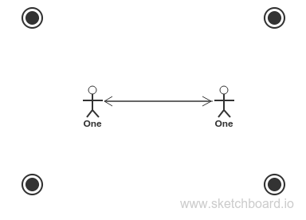

much good stuff in starbook project assignment

# Data Modeling 2
The last lesson on data modeling got you thinking about how users will interact with your data and the possiblity of storing your data differently to facilitate different interactions.

This lesson introduces the principle types of interactions that data will have within itself.  Intuitively you can tell that a simple list of names is quite different from an interconnected social network, but how?  This lesson will give you some vocabulary to start exploring the differences.  
___
### Relationship Types
Data relationships and data types can be classified by their degree of interconnectedness.  From the example above: 
* A simple list of names has no connections between names, each one is a free-standing data entry with no cares in the world.
* A social network has inidivuals:  
    * An individual can only have 1 bio and that bio is only connected to one individual.  
    * One individual can have multiple statuses, but each status can only have 1 individual.  
    * Each individual can be connected to multiple other individuals. 
     
From a data modeling point of view there are only 3 numbers - 0, 1, and 'many'.  A data relation is between two units of data, the relationship types are the possible ways of combining 0, 1 and 'many':
* Zero to Zero:
    * 
* One to One:
    * 
* One to Many,  or Many to One:
    * 
* Many to Many:
    * 

That's about all you need to know to get started.  
___

### Resources

* [Many-to-Many in Mongoose](https://github.com/elewa-academy/General-Resources/blob/master/backend-libraries/mongoose.md)

___
___
### 
