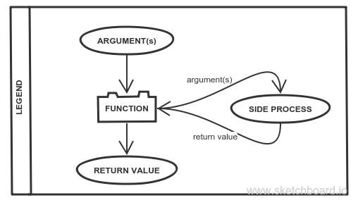

# [Recursion](https://elewa-academy.github.io/General-Resources/cs-101/recursion-101.html)
"A function that calls itself until it doesn't."
    - Mattias P Johansson
    
Index:  
* [Recursion is that simple](#recursion-is-that-simple)...
* [simple examples](#a-couple-very-simple-examples)
* ... [except when it's not.](#except-when-its-not-that-simple)
* [When and How](#when-and-how-to-recurse)
* [Reversing a Word](#reversing-a-word) - a case study
    * [Is Recursion appropriate?](#is-this-problem-recursive)
    * It is. [How to begin?](#breaking-down-the-problem)
    * [Visualizing the solution](#visualizing-the-solution)
    * [Coding the Solution](#code-for-the-diagram)
* [Resources](#resources)
* [Next Steps](#next-steps)
___
## Recursion is that simple ...
That's all. Done.  Recursive functions call themselves until they don't.  It really is that simple.
___
### A couple very simple examples
Two basic recursive functions that ALMOST fit Mr. Johansson's definition.  What is missing?
```javascript
var demo = function recurse(word) {
    console.log(word);
    recurse(word);
};
var demo_slice = function recurse(word) {
    console.log(word);
    word = word.slice(0, word.length - 1)
    recurse(word);
};
```
These functions are declareded as _Named Function Expressions_. Nfe's are uniquely suited for recursive funcitons, the function's name (recurse) is only available within the function.  Outside the function 'recurse' is not available, only 'demo'.

If you're into these nerdy JS details:
* [short intro to nfe's](http://raganwald.com/2014/10/24/fun-with-named-functions.html)
* [Complete intro to nfe's](https://kangax.github.io/nfe/)

___
## Except when its not that simple. 
Recursion as a principle is very simple.  
Understanding when recursion is the right choice is trickier.  
Writing good recursive solutions can be very hard.

This lesson will only go as far as how to recognize when recursion may be the right choice. For further study complete the[ _data structures_](https://github.com/jankeLearning/projects/tree/master/03-data-structures) project and consult the [resources](#resources) a the bottom of this page.
___
### When and How to Recurse
If you think recursion may be appropriate, ask yourself these questions:
1. Is the task I’m trying to achieve composed of similar sub-tasks?
2. Are those subtasks all pretty much identical?

If you answered ‘yes’ to these questions, it’s recursion time -->

1. What is the simplest sub-task that composes my main goal?
2. What’s the smallest component (base case) on which I can perform this task?
3. How do I break the large component into smaller ones?
4. How do I know when I’m at the smallest component (base case)?
5. How do I rebuild my smaller solutions back into my final solution?

Let's see this in action with an example:
___
# Reversing a Word
A CASE STUDY IN RECURSION
___
### Is This Problem Recursive
Let's try to find a recursive solution to reversing a word:
1. Is the task I’m trying to achieve composed of similar sub-tasks?
    * YES!  The word is made up of many letters, and each pair letter will need to be reversed.
2. Are those subtasks all pretty much identical?
    * YES!  Reversing two letters is the same no matter which two letters they are.

Cleared for take off -->
___
### Breaking down the problem
Let's ask some questions to start off our recursive solution:
1. What is the simplest sub-task that composes my main goal?
    * Reversing chunks of letters that make up the word. 
2. What’s the smallest component (base case) on which I can perform this task?
    * Either a pair of single letters OR one letter and an 'empty letter' (undefined) - depending on if a word (or fragment of a word) is even or odd.
3. How do I break the large component into smaller ones?
    * Split the word in half.
4. How do I know when I’m at the smallest component (base case)?
    * Use conditional checks to see if your current argument looks like any of these:
        * letter+undefined 
        * undefined+letter
        * letter+letter
5. How do I rebuild my smaller solutions back into my final solution?
    1. Reverse them and concatinate them.  
    2. Return the new string so the previous recursive call can do the same with this substring and it's buddy.
    
So what do these answers mean?  When figuring out tricky algorithms it's best to pick a specific example and visually work it through by hand.
___
### Visualizing the Solution
Below is a diagram that takes an example argument 'mattress' and illustrates the recursive solution indicated by our answers to the above questions.  



__Mini Quiz__: Can you guess why this example uses an 8 letter word?

___
### Code for the Diagram 
Functions like the simple examples at the top of the page can only break down the input, they can't reconstruct a final solution out of the smaller pieces.  Add in a return statement and your recursive functions become much more powerful.  You can now construct larger solutions out of the smaller pieces.

In this example the smaller pieces are individual letters that have been reversed and the larger solution is a whole word that has been reversed.  
```javascript
function recursion_starter(word) {
    // this function exists so you can pass in whole words.
    //   why is a starter necessary?
    var first_half = word.slice(0, word.length/2);
    var second_half = word.slice(word.length/2);
    return word_reverser(first_half, second_half);
};

var word_reverser = function recurse(first_half, second_half) {
    // identify base cases -
    //      If you have a base case, perform your operation and return the result
    if ((first_half == undefined)) {
        return second_half; 
    } else if ((second_half == undefined)) {
        return first_half; 
    } else if ((first_half.length == 1) && (second_half.length == 1)) {
        return second_half + first_half; 
    } // if no basecases are met, move closer to a basecase
    else {
        var second_1 = second_half.slice(0, second_half.length/2);
        var second_2 = second_half.slice(second_half.length/2);
        var first_1 = first_half.slice(0, first_half.length/2);
        var first_2 = first_half.slice(first_half.length/2);
        // notice 'second' is first, and 'first' is second.
        return recurse(second_1, second_2) + recurse(first_1, first_2);
    };
};

console.log(recursion_starter('mattress'));
``` 
__Study Tip__: 
* Run this code in [Loupe](http://latentflip.com/loupe/) to watch how JS keeps track of the many recursive calls.
* Place 'console.log's or 'debugger's throught the method to see the intermediate steps from the diagram.

__Challenge__: Can you figure out how to replace the recursive calls with a 'while' loop?

__Extra Challengy Challenge__: This function is not very efficient, it uses what is called _tail end recursion_.  Try reversing different words until you find one you can't reverse any more.  
Can you figure out how to reorganize this function so it can reverse larger words?
___
### Resources
Like with algorithms, recursion is a tricky topic.  Take a look through all of these articles to find the one that works best for you. If you find something we missed be sure to let us know!
* [Funfunfun Recursion](https://www.youtube.com/watch?v=k7-N8R0-KY4). Great video, es6 and recursion
* [9 Exercises](http://www.w3resource.com/javascript-exercises/javascript-recursion-functions-exercises.php)
* [An easy Medium article](https://medium.com/@zfrisch/understanding-recursion-in-javascript-992e96449e03) with plenty of nice examples.
* [FCC's article](https://medium.freecodecamp.org/recursion-in-javascript-1608032c7a1f). Slightly more advanced, full of examples.
* [Recursion in the wild](https://www.sitepoint.com/recursion-functional-javascript/).  A more advnaced article on applying recursion.
* [Code Academy](https://www.codecademy.com/courses/javascript-lesson-205/0/1) exercises
* [A search of FreeCodeCamp for 'Recursion'](https://medium.freecodecamp.org/search?q=recursion)
* [On tail calls](https://medium.com/functional-javascript/recursion-282a6abbf3c5)
* [Simpler video with good animations](https://www.youtube.com/watch?v=FyHloXKnPWc). Loops vs. Recursion  
* [Tail calls in es6](http://jimrottinger.github.io/es6-tail-call-optimization/)  

___
### Next Steps
The best two options for further exploring recursion are _sorting algorithms_ and _data structures_.  We reccomend going the data structrure route, if you'd like to spend some extra time to learn about sorting just let us know.  We can point you the way.


___
___
### <a href="http://elewa.education/blog" target="_blank"></a>